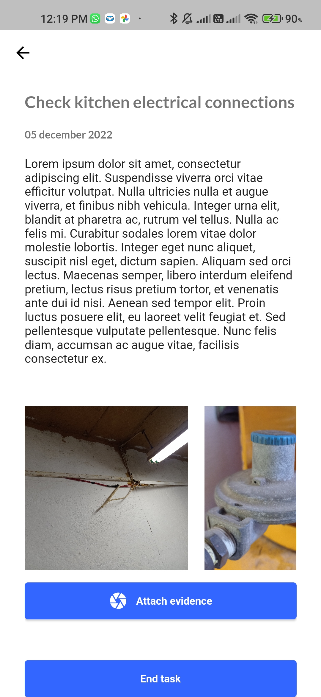

# Task APP


This is a simple mobile task application designed for android using Flutter. 

## Source
The code of the application is located in the source folder, also, you can find the .yaml file and the assets used.
``` 
soource/
  - assets/
  - lib/
      |---- components
      |---- localizations
      |---- models
      |---- pages
      |---- pages
      |---- screens 
      main.dart
  - pubspec.yaml
```

## ScreenShots

<table>
  <tr>
    <td>  </td>
    <td>  </td>
    <td>  </td>
    <td>  </td>
    <td>  </td>
  </tr>
</table>


``` 
Application developed as a school project for the Mobile Applications subject.  
```
